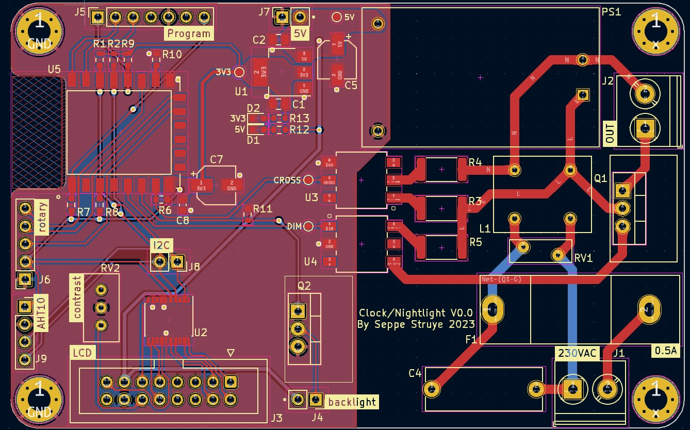
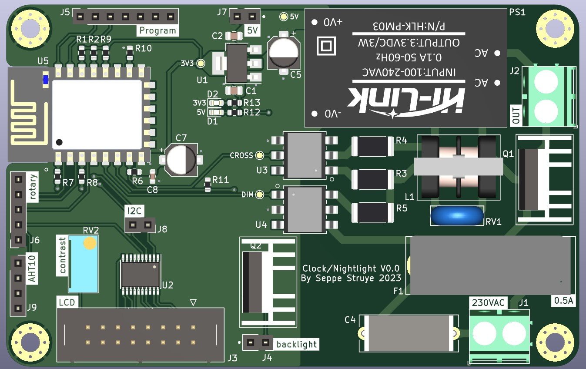
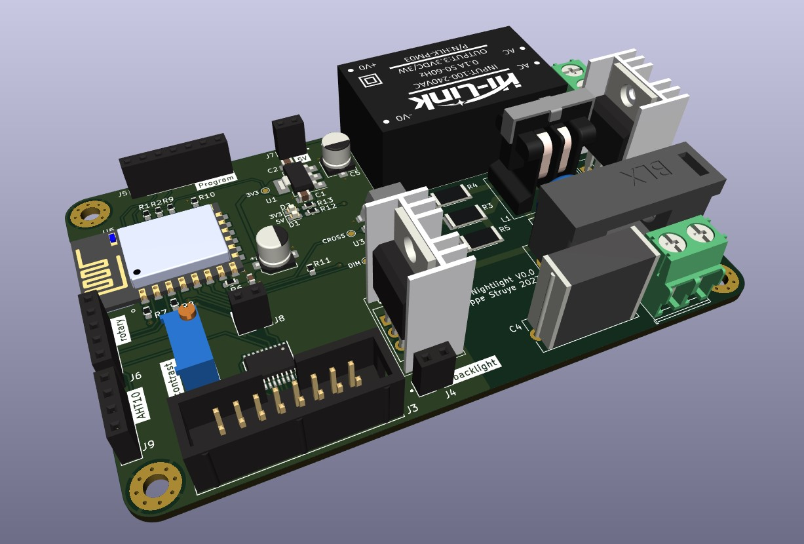
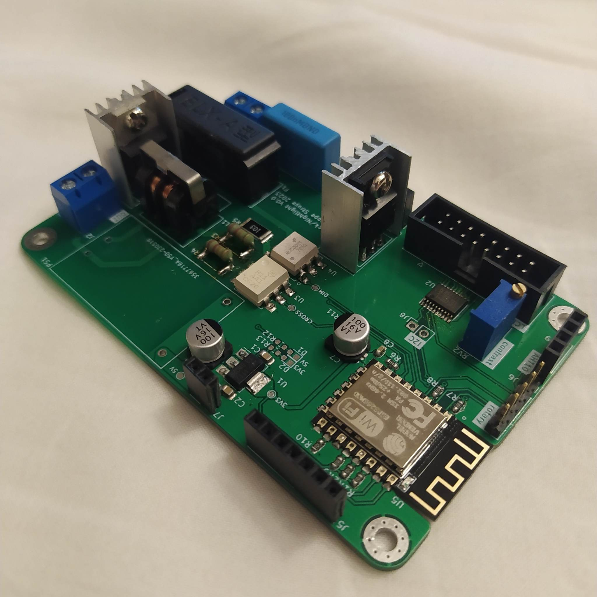

# dimmable nightlight + clock using ESP12F(ESP8266)
This PCB design was an idea for a night light in combination with a clock. I found an old 4x40 LCD panel to use as display.
# PCB desing
- for the dimmable light i used a triac dimmer circuit.
- To save pins i used a multiplexer for the LCD.
- I also added a header that can be used for a rotary encoder and a header that can be used for an I2C temperature sensor or something else using I2C.

  

## result

# software
- I had to edit the arduino liquidcrystal-I2C library to accomodate for the LCD using two LCD drivers. 1 for the top 2 rows and one for the bottom 2 rows. If i hadn't used a multiplexer
this wouldn't have been necessary.
- DMC40457_clock is a library i created to handle te logic behind the displaying of characters on to the lcd.
- clock_software.ino is the arduino sketch that runs on the ESP12F.
